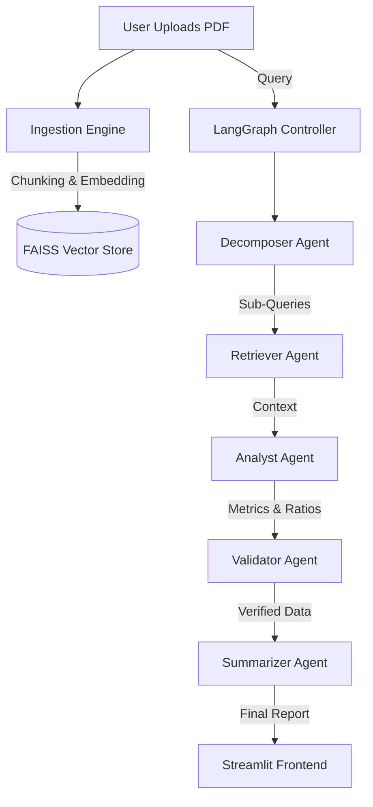

# 🏦 FinDoc Risk Engine  
**Agentic Financial Analysis & Risk Computation System**  


**FinDoc AI** is an intelligent, multi-agent system designed to analyze complex financial documents (Annual Reports, P&L Statements, Balance Sheets). It moves beyond simple "Chat with PDF" wrappers by using a **dedicated graph of specialized agents** to decompose queries, validate data, and compute strict financial ratios with deterministic accuracy.

---

## 📸 Dashboard Preview

| **Risk Dashboard** | **Analysis Report** |
|:---:|:---:|
|  |  |

| **Deep Search** | **Accuracy Verification** |
|:---:|:---:|
|  |  |

---

## 🌟 Key Features

### 🧠 1. Multi-Agent Architecture (LangGraph)
Unlike standard RAG, FinDoc uses a team of agents:
-   **Decomposer Agent**: Breaks down complex questions (e.g., "Analyze debt risk") into atomic sub-tasks.
-   **Retriever Agent**: Uses dense vector search (FAISS) with Reciprocal Rank Fusion to find scattered data.
-   **Analyst Agent**: Extracts specific metrics (Revenue, EBITDA) and computes Python-based ratios (Interest Coverage).
-   **Validator Agent**: Cross-checks extracted numbers against logical rules (e.g., Debt cannot be negative) and flagged logic.
-   **Summarizer Agent**: Synthesizes a human-readable report with citations.

### 🛡️ 2. Dynamic Confidence Scoring
The system doesn't just guess. It assigns a **Confidence Score (0-100%)** based on:
-   **Data Completeness**: Did we find all required metrics for the ratio?
-   **Source Density**: Did the info appear on multiple pages?
-   **Rule Validation**: Did the math pass sanity checks?

### ⚡ 3. Real-Time Processing
-   **Smart Ingestion**: Recursive chunking strategies that respect financial tables and paragraphs.
-   **Auto-Reset Memory**: Guarantees clean state between uploads (no "hallucinating" data from previous files).
-   **Polling UI**: Real-time status feedback during heavy document processing.

---

## 🏗️ System Architecture



---

## 🚀 Installation & Setup

### Prerequisites
- Python 3.10+
- OpenAI API Key (or OpenRouter)

### 1. Clone Repository
```bash
git clone https://github.com/yashmishra1234567890/FinDoc-Risk-Engine.git
cd FinDoc-Risk-Engine
```

### 2. Install Dependencies
```bash
pip install -r requirements.txt
```

### 3. Configure Environment
Create a `.env` file in the root directory:
```ini
OPENAI_API_KEY=sk-xxxx...
# Optional: Set Project Root
PYTHONPATH=.
```

### 4. Run the Application
**Backend (FastAPI)**
```bash
uvicorn app.main:app --host 0.0.0.0 --port 8000
```

**Frontend (Streamlit)**
```bash
streamlit run frontend/app.py
```

---

## 📂 Sample Documents Included
To help recruiters and users test the system immediately, we bundled real-world examples:
1.  **Vodafone Idea (Telecom)**: High Debt analysis scenario.
2.  **TCS (Steel/Manufacturing)**: Complex balance sheet structure.
3.  **Tech Mahindra (IT Services)**: Revenue and growth analysis.

---

## 🛠️ Technology Stack

-   **LLM Orchestration**: [LangGraph](https://langchain-ai.github.io/langgraph/)
-   **Vector Database**: [FAISS](https://github.com/facebookresearch/faiss) (In-Memory)
-   **Backend Framework**: [FastAPI](https://fastapi.tiangolo.com/)
-   **Frontend**: [Streamlit](https://streamlit.io/)
-   **Parsing**: PDFPlumber & RecursiveCharacterSplitter
-   **Deployment**: Render (Dockerized)

---

## 🤝 Contributing
1.  Fork the Project
2.  Create your Feature Branch (`git checkout -b feature/AmazingFeature`)
3.  Commit your Changes (`git commit -m 'Add some AmazingFeature'`)
4.  Push to the Branch (`git push origin feature/AmazingFeature`)
5.  Open a Pull Request

---

### ⚠️ Disclaimer
FinDoc AI is a support tool for financial analysis. While it uses advanced validation logic, all financial decisions should be verified by human professionals. The demo runs on free cloud instances and may experience "cold start" latency.

---
*Built with ❤️ by [Yash Mishra]*
python -m evaluation.evaluator
```
Results will be saved to `evaluation/results.md`.

## ☁️ Deployment (Render)

1.  Push this repository to GitHub/GitLab.
2.  Create a **Web Service** on [Render](https://render.com/).
3.  Connect your repository.
4.  Render will automatically detect the `Procfile` and `requirements.txt`.
5.  **Important**: Add your `OPENAI_API_KEY` in the Render Environment Variables settings.
6.  Deploy!

## 📊 Evaluation Results
See [evaluation/results.md](evaluation/results.md) for the latest benchmark runs.
