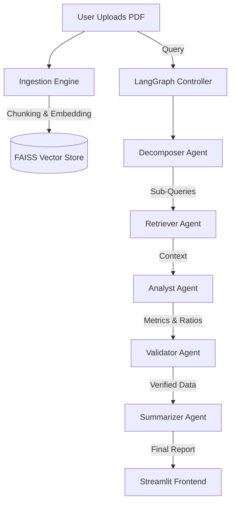

# 🏦 FinDoc Risk Engine  
**Your Agentic, Decision-Support Financial Analyst**  


### 🚀 [Live Demo](https://yashmishra1234567890-findoc-risk-engine-frontendapp-0k0ooh.streamlit.app/)

---

## 🎥 Quick Demo
Upload a massive Annual Report and watch FinDoc's team of specialized AI agents extract complex metrics, compute strict financial ratios, and generate a confidence-backed risk assessment in seconds. 
*Watch the [Demo Video Here](#) (Placeholder)*

## 🧠 Project Overview
FinDoc is designed as a **decision-support AI system**, combining LLM semantic reasoning with strict rule-based validation to produce reliable financial risk insights.

Instead of just being another "Chat with PDF" wrapper, FinDoc uses a **team of specialized AI agents** working together to break down questions, validate the math, and compute strict financial ratios so you get reliable insights, not hallucinations.

---

## 🧩 The Problem Statement
Financial analysis requires navigating massive 300+ page PDFs to find scattered metrics (Revenue, EBITDA, Debt, Interest) hidden in tiny tables. Traditional RAG systems frequently hallucinate numbers or fail at mathematical reasoning (like computing an Interest Coverage Ratio). 
**FinDoc solves this** by mathematically validating the extractions using standard financial rules before returning an answer.

---

## 💬 Example Query
**User:** *"Analyze the debt risk and interest coverage for this year."*  
**FinDoc Pipeline:**
1. Breaks query into "Total Debt", "EBITDA", and "Interest Expense" searches.
2. Extracts specific numbers and checks the math.
3. **Output:** "Interest Coverage Ratio is 4.5x with a 95% Confidence Score. Risk Level is Low."

---

## 📸 Dashboard Preview

| **Risk Dashboard** | **Analysis Report** |
|:---:|:---:|
|  |  |

| **Deep Search** | **Accuracy Verification** |
|:---:|:---:|
|  |  |

---

## ✨ Engineering Highlights

*   **Multi-Agent AI Architecture:** Implemented a LangGraph-based agent system (Decomposer → Retriever → Analyst → Validator → Summarizer) instead of relying on a single LLM response.
*   **Numerical Reasoning + Validation:** Extracts financial metrics (Revenue, EBITDA, Debt) and computes ratios while computationally validating results against rule-based checks.
*   **Robust RAG Pipeline:** Uses FAISS vector search + Reciprocal Rank Fusion to retrieve tables and paragraphs from huge annual reports.
*   **Confidence Scoring Engine:** Generates a 0–100% reliability score based on data completeness, rule validation, and source density.
*   **Async Document Processing:** Handles 300+ page annual reports without blocking the UI utilizing FastAPI background tasks.
*   **Security-Hardened Vector Store:** Path containment and safe deserialization safeguards protect FAISS ingestion from malicious pickle injection.
*   **Dynamic Embedding Compatibility:** Automatically scales vector dimensions to allow seamless swapping of embedding models.

---

## 🏗️ System Architecture

FinDoc processes data sequentially through a cyclic agent graph:
1. **Decomposer** splits the query.
2. **Retriever** fetches chunks.
3. **Analyst** calculates formulas.
4. **Validator** logically rules out hallucinations.


```mermaid
graph TD
    User[User Uploads PDF] --> Ingest[Ingestion Engine]
    Ingest -->|Chunking & Embedding| VectorDB[(FAISS Vector Store)]
    
    User -->|Query| Graph[LangGraph Controller]
    
    Graph --> Decomposer[Decomposer Agent]
    Decomposer -->|Sub-Queries| Retriever[Retriever Agent]
    Retriever -->|Context| Analyst[Analyst Agent]
    
    Analyst -->|Metrics & Ratios| Validator[Validator Agent]
    Validator -->|Verified Data| Summarizer[Summarizer Agent]
    
    Summarizer -->|Final Report| UI[Streamlit Frontend]
```

---

## 🚀 Installation & Setup

### Prerequisites
- Python 3.10+
- OpenRouter API Key

### 1. Clone Repository
```bash
git clone https://github.com/yashmishra1234567890/FinDoc-Risk-Engine.git
cd FinDoc-Risk-Engine
```

### 2. Install Dependencies
```bash
pip install -r requirements.txt
```

### 3. Configure Environment
Create a `.env` file in the root directory:
```ini
OPENROUTER_API_KEY=sk-xxxx...
# Optional: Set Project Root
PYTHONPATH=.
```

### 4. Run the Application
**Backend (FastAPI)**
```bash
uvicorn app.main:app --host 0.0.0.0 --port 8000
```

**Frontend (Streamlit)**
```bash
streamlit run frontend/app.py
```

---

## 📂 Project Structure
```text
├── agents/             # The LangGraph Agent Logic
├── app/                # FastAPI backend routers and config
├── data/               # Pre-loaded PDF Sample Reports
├── evaluation/         # Baseline testing and PyTest RAG evaluation
├── frontend/           # Streamlit UI dashboard
├── graph/              # Langchain State definitions and Nodes
├── ingestion/          # PDF Chunking, RRF Loading, Embeddings
└── vectorstore/        # Hardened FAISS Local indexes
```

---

## 🛠️ Technology Stack

-   **LLM Orchestration**: [LangGraph](https://langchain-ai.github.io/langgraph/)
-   **Vector Database**: [FAISS](https://github.com/facebookresearch/faiss) (In-Memory)
-   **Backend Framework**: [FastAPI](https://fastapi.tiangolo.com/)
-   **Frontend**: [Streamlit](https://streamlit.io/)
-   **Parsing**: PDFPlumber & RecursiveCharacterSplitter
-   **Deployment**: Render (Dockerized)

---

## 🔮 Future Improvements Roadmap
- [ ] Multi-user vector database isolation (Session-based FAISS)
- [ ] Migrate `print()` statements to structured Python `logging`
- [ ] Complete Dockerized deployment with isolated DB container
- [ ] Support Streaming chunked LLM responses to frontend

---


### ⚠️ Disclaimer
FinDoc AI is a support tool for financial analysis. While it uses advanced validation logic, all financial decisions should be verified by human professionals. The demo runs on free cloud instances and may experience "cold start" latency.

---

## 📊 Evaluation 
```bash
python -m evaluation.evaluator
```
Results will be saved to `evaluation/results.md`.

## ☁️ Deployment (Render)

1.  Push this repository to GitHub.
2.  Create a **Web Service** on [Render](https://render.com/).
3.  Connect your repository.
4.  Render will automatically detect the `Procfile` and `requirements.txt`.
5.  **Important**: Add your `OPENROUTER_API_KEY` in the Render Environment Variables settings.
6.  Deploy!
