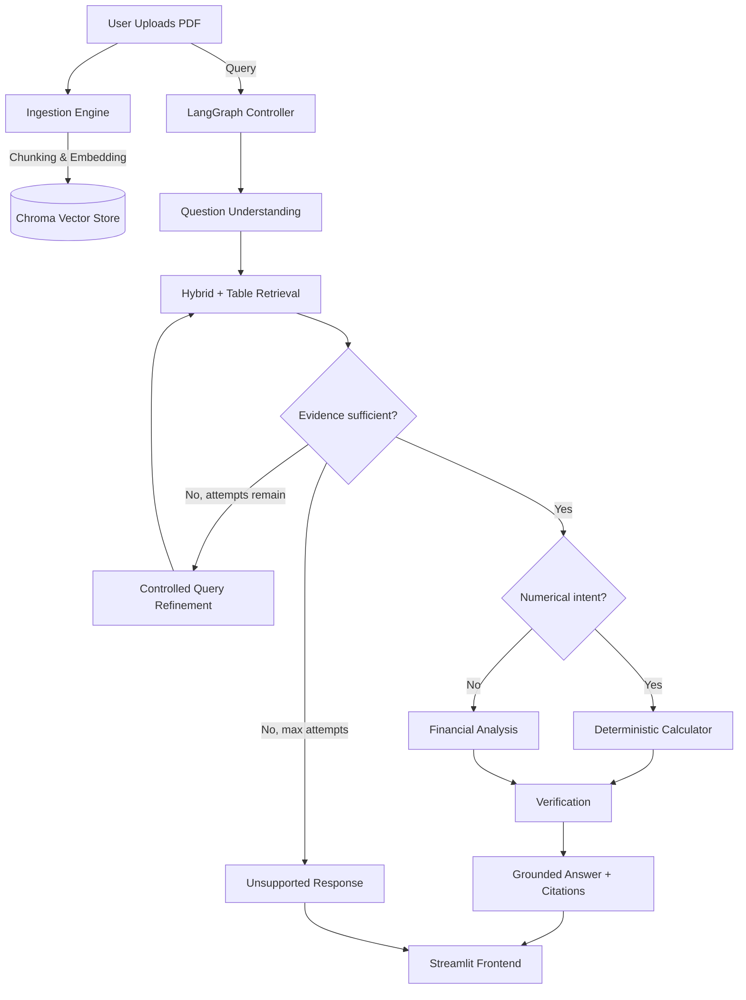

# FinDoc v2

FinDoc retrieves financial evidence, performs deterministic calculations, verifies results, and returns grounded answers with page and table provenance.


### 🚀 [Live Demo](https://yashmishra1234567890-findoc-risk-engine-frontendapp-0k0ooh.streamlit.app/)

---

## 🎥 Quick Demo
Upload a massive Annual Report and watch FinDoc's team of specialized AI agents extract complex metrics, compute strict financial ratios, and generate a confidence-backed risk assessment in seconds. 
*Watch the [Demo Video Here](#) (Placeholder)*

## Problem and Solution

Standard financial RAG can miss exact terminology, flatten table relationships, make arithmetic errors, or answer unsupported questions as facts. FinDoc v2 follows:

**Retrieve -> Reason -> Calculate -> Verify -> Ground -> Explain**

Instead of just being another "Chat with PDF" wrapper, FinDoc uses a **team of specialized AI agents** working together to break down questions, validate the math, and compute strict financial ratios so you get reliable insights, not hallucinations.

---

## 🧩 The Problem Statement
Financial analysis requires navigating massive 300+ page PDFs to find scattered metrics (Revenue, EBITDA, Debt, Interest) hidden in tiny tables. Traditional RAG systems frequently hallucinate numbers or fail at mathematical reasoning (like computing an Interest Coverage Ratio). 
**FinDoc solves this** by mathematically validating the extractions using standard financial rules before returning an answer.

---

## 💬 Example Query
**User:** *"Analyze the debt risk and interest coverage for this year."*  
**FinDoc Pipeline:**
1. Breaks query into "Total Debt", "EBITDA", and "Interest Expense" searches.
2. Extracts specific numbers and checks the math.
3. **Output:** "Interest Coverage Ratio is 4.5x with a 95% Confidence Score. Risk Level is Low."

---

## 📸 Dashboard Preview

| **Risk Dashboard** | **Analysis Report** |
|:---:|:---:|
|  |  |

| **Deep Search** | **Accuracy Verification** |
|:---:|:---:|
|  |  |

---

## ✨ Engineering Highlights

*   **Multi-Agent AI Architecture:** Implemented a LangGraph-based agent system (Decomposer → Retriever → Analyst → Validator → Summarizer) instead of relying on a single LLM response.
*   **Bounded Agentic Retrieval:** Checks evidence after each retrieval, refines the query deterministically, and stops after at most three attempts.
*   **Numerical Reasoning + Validation:** Extracts financial metrics (Revenue, EBITDA, Debt) and computes ratios while computationally validating results against algorithmic benchmarks.
*   **Robust RAG Pipeline:** Uses disk-backed Chroma vector search + Reciprocal Rank Fusion to retrieve tables and paragraphs from huge annual reports and removes duplicate document chunks to save token limits.
*   **Federated Validation:** Cross-checks extracted metrics against the PDF, live Yahoo Finance market data, and SEC EDGAR snapshots for a more grounded risk signal.
*   **Confidence Scoring Engine:** Generates a 0–100% reliability score based on data completeness, rule validation, source density, and market temperature.
*   **Async Document Processing:** Handles 300+ page annual reports without blocking the UI utilizing FastAPI background tasks and polling.
*   **Security-Hardened Vector Store:** Path containment and disk-backed persistence protect Chroma ingestion from unsafe path traversal and keep large indexes stable across restarts.
*   **Dynamic Embedding Compatibility:** Automatically scales vector dimensions to allow seamless swapping of embedding models.
*   **Grounding Contract:** API responses include citations, calculation details, verification status, and risk-summary signals.

---

## System Architecture

The graph uses hybrid retrieval, a bounded evidence check, deterministic numerical reasoning when required, validation, and grounded summarization. Insufficient evidence is retried with controlled query refinement for at most three total retrieval attempts; unsupported claims are rejected.


```mermaid
graph TD
    User[User Uploads PDF] --> Ingest[Ingestion Engine]
    Ingest -->|Chunking & Embedding| VectorDB[(Chroma Vector Store)]
    
    User -->|Query| Graph[LangGraph Controller]
    
    Graph --> Decomposer[Question Understanding]
    Decomposer --> Retriever[Hybrid + Table Retrieval]
    Retriever --> Evidence{Evidence sufficient?}
    Evidence -->|No, attempts remain| Refine[Controlled Query Refinement]
    Refine --> Retriever
    Evidence -->|Yes| Reason{Numerical intent?}
    Reason -->|Yes| Calculate[Deterministic Calculator]
    Reason -->|No| Analyze[Financial Analysis]
    Calculate --> Verify[Verification]
    Analyze --> Verify
    Verify --> Answer[Grounded Answer + Citations]
    Evidence -->|No, max attempts| Reject[Unsupported Response]
    Answer --> UI[Streamlit Frontend]
    Reject --> UI
```

---

## Local Setup

### Prerequisites
- Python 3.10+
- OpenRouter API Key

### 1. Clone Repository
```bash
git clone https://github.com/yashmishra1234567890/FinDoc-Risk-Engine.git
cd FinDoc-Risk-Engine
```

### 2. Install Dependencies
```bash
pip install -r requirements.txt
```

### 3. Configure Environment
Set the secret in the environment or a local `.env` file, which must not be committed:
```ini
OPENROUTER_API_KEY=<your-local-key>
PYTHONPATH=.
CORS_ORIGINS=http://localhost:8501
BACKEND_URL=http://localhost:8000
```

Install and run the backend:

```bash
pip install -r requirements.txt
uvicorn app.main:app --host 0.0.0.0 --port 8000
```

In a second terminal, run Streamlit:

```bash
streamlit run frontend/app.py
```

The Streamlit app reads `BACKEND_URL` from the environment. It defaults to the deployed Render backend for the hosted demo; set it to the local backend URL for local development.

## Environment Variables

Required for LLM-backed answers:

- `OPENROUTER_API_KEY`: API key stored only in local environment or platform secret settings.

Backend configuration:

- `CORS_ORIGINS`: comma-separated allowed frontend origins. Set this to the deployed Streamlit URL on Render.
- `HOST`: bind host; Render uses `0.0.0.0`.
- `PORT`: bind port; Render provides this automatically.
- `PYTHONPATH`: repository root, normally `.`.

Frontend configuration:

- `BACKEND_URL`: public FastAPI base URL, for example `https://<service>.onrender.com`.

Do not commit `.env`, API keys, tokens, or generated vector/evaluation artifacts.

---

## 📂 Project Structure
```text
├── agents/             # The LangGraph Agent Logic
├── app/                # FastAPI backend routers and config
├── data/               # Pre-loaded PDF Sample Reports
├── evaluation/         # Baseline testing and PyTest RAG evaluation
├── frontend/           # Streamlit UI dashboard
├── graph/              # Langchain State definitions and Nodes
├── ingestion/          # PDF Chunking, RRF Loading, Embeddings
└── vectorstore/        # Hardened Chroma local indexes
```

---

## 🛠️ Technology Stack

-   **LLM Orchestration**: [LangGraph](https://langchain-ai.github.io/langgraph/)
-   **Vector Database**: [ChromaDB](https://www.trychroma.com/) (Disk-Backed)
-   **Backend Framework**: [FastAPI](https://fastapi.tiangolo.com/)
-   **Frontend**: [Streamlit](https://streamlit.io/)
-   **Parsing**: PDFPlumber & RecursiveCharacterSplitter
-   **Deployment**: Render (Dockerized)

---

## 🔮 Future Improvements Roadmap
- [ ] Multi-user vector database isolation (Session-based Chroma namespaces)
- [ ] Migrate `print()` statements to structured Python `logging`
- [ ] Complete Dockerized deployment with isolated DB container
- [x] Support streaming chunked LLM responses to frontend

---


### ⚠️ Disclaimer
FinDoc AI is a support tool for financial analysis. While it uses advanced validation logic, all financial decisions should be verified by human professionals. The demo runs on free cloud instances and may experience "cold start" latency.

---

## Evaluation

The reproducible runner derives supported questions from the five PDFs in `data/financial_docs` and includes explicit unsupported cases. The latest measured run contains 88 records:

| Metric | Original RAG | FinDoc v2 |
|---|---:|---:|
| Recall@5 | 0.2812 | 0.7952 |
| MRR | 0.2698 | 0.6855 |
| Numerical accuracy | 0.1053 | 0.5526 |
| Average benchmark latency (s) | Not measured | 82.7613 |

Regenerate with:

```powershell
.\venv\Scripts\python.exe -m evaluation.runner
```

Outputs are written to `evaluation/results/findoc_v2.json` and `evaluation/results/findoc_v2.md`. These values are corpus/configuration specific and must be regenerated after changes.

## Backend Deployment on Render

1. Push this repository to GitHub. GitHub is the deployment source of truth.
2. Create a Render **Web Service** connected to the repository.
3. Use the detected `Procfile` start command:

    ```text
    web: uvicorn app.main:app --host 0.0.0.0 --port $PORT
    ```

4. Set the Render environment variables:
    - `OPENROUTER_API_KEY`
    - `CORS_ORIGINS=https://<your-streamlit-app>.streamlit.app`
    - `PYTHONPATH=.`
5. Deploy and verify `https://<your-service>.onrender.com/health` returns `status: ok`.

## Frontend Deployment on Streamlit Community Cloud

1. Connect the same GitHub repository.
2. Set the main file to `frontend/app.py`.
3. Add the Streamlit secret/environment variable `BACKEND_URL` with the public Render backend URL.
4. Deploy and upload a PDF through the sidebar.

The frontend remains Streamlit; no React application is required.

## Demo Instructions

1. Open the Streamlit URL.
2. Upload a financial PDF or select a bundled sample.
3. Wait for ingestion to complete.
4. Ask a factual, table, or numerical question.
5. Review the answer, calculation, verification status, evidence pages, table metadata, and risk summary.
6. For a backend smoke check, open the Render `/health` endpoint before querying.
